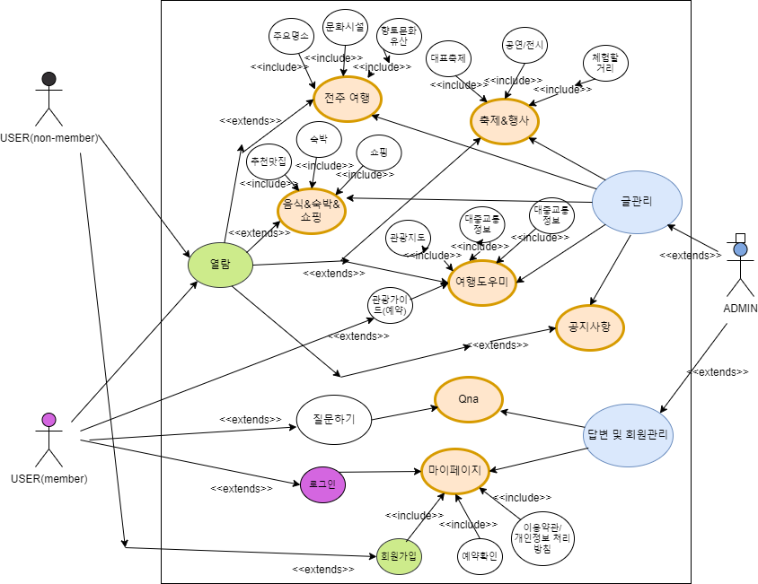
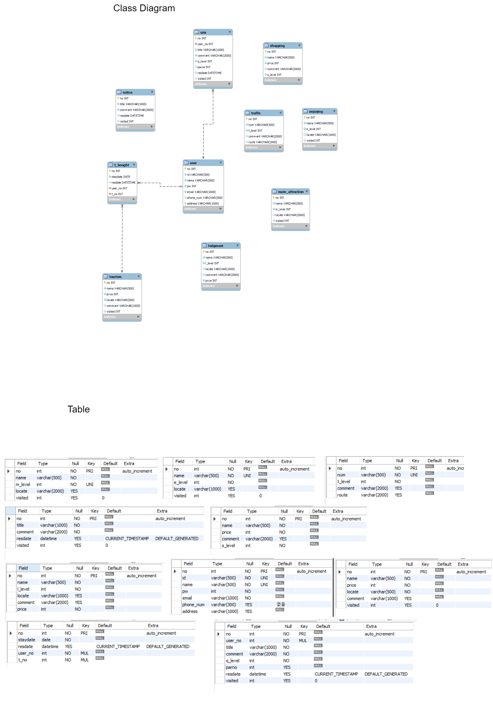

#프로젝트 개발 보고서(Project Development Report)
----------------------------------------------
## 1. 프로젝트 개요(Project Outline) 

```
전주시를 여행하기 위해서 필요한 정보들을 모아놓은
웹 어플리케이션을 개발한다. 
```

## 2. 프로젝트 목적(Project Purpose)
```
사용자가 전주시를 여행하는데에 도움이될만한 정보들과
숙박 및 축제와 기타 행사들을 소개해주려고 한다.
```

## 3. 프로젝트 개발 환경 정보(Project Development Envirment)   


    - Topic : Jeonju intro web application
    - Develop Envirment : Open JDK 11
    - Languege : Java 11
    - Web Module : Jsp/Servlet 3.0
    - Process Pattern : MVC Pattern
    - Database System : Mysql 8.0
    - Database Design : Mysql Workbanch
    - Entity Relationship Design : draw.io 20.8.16
    - Java Database Connector : mysql-connector-java-8.0
    - Application Design : Object aid 1.2.4
    - Back Template Languege : Java/Servlet 11
    - Front Template Languege : Jsp(JSTL/EL) 3.0/HTML5/CSS3/Javascript ES5
    - Web (Application) Server : Tomcat 9.0
    - Navigation Design : WordCloud 3.7, Card Sort BoardMix


<br><br><br>

## 4. 프로젝트 기획 및 설계(roject Planning & Design)

### 4-1. 네비게이션 설계(Navigation Design)

| 전주 여행 | 축제&행사 | 음식&숙박&쇼핑 | 여행도우미 | 마이페이지 | 공지사항 |
|--------|---------|-------|--------|----------|-------|
| 주요명소 | 대표축제 | 추천맛집 | 관광지도 | 로그인 | Qna |
| -자연 | 공연/전시 | 숙박 |대중교통 정보 | 회원가입|
| -역사 전통 | 체험할거리 | 쇼핑 | 관광가이드(예약) | 예약확인 |
| 문화시설 | -야외용 | &nbsp; | 갤러리 | 이용약관/(개인정보처리방침) |
| 향토문화유산 |-실내용 | &nbsp; | &nbsp; | &nbsp; |

<br>

#### 4-1-1. 자료 수집


#### 4-1-2. 콘텐츠 분류


#### 4-1-3. 서비스 흐름 설계


### 4-2. 데이터베이스 설계(Database Design)

#### 4-2-1. 개념적 설계

### 4-2-2. 논리적 설계

### 4-2-3. 물리적 설계

